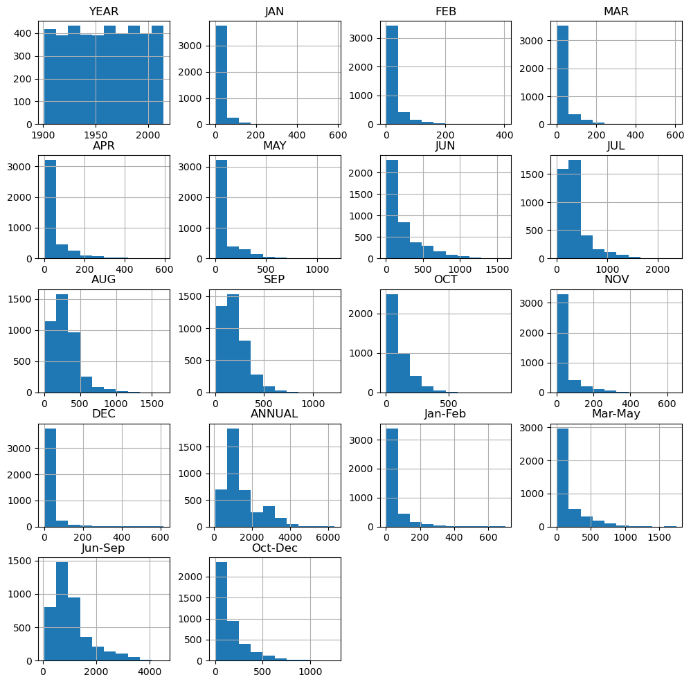

# Rainfall Analysis in India

This project performs a big data analysis on rainfall trends in India, visualizing various aspects of rainfall data from 1901 to 2015.

## Introduction
India's climate, primarily dependent on monsoon patterns, is crucial for agriculture, economy, and daily life. This project explores rainfall trends over more than a century, using visualization techniques to uncover insights.

## Dataset
The dataset used is the **Rainfall in India 1901-2015** dataset, which includes:
- **Subdivision**: Geographical subdivision of India.
- **Year**: Yearly data from 1901 to 2015.
- **Annual Rainfall**: Total annual rainfall recorded.

You can access the dataset from [here](https://www.kaggle.com/datasets/kkhandekar/statewise-rainfall-1901-to-2015).

## Project Structure
1. **Data Preprocessing**: Loads the dataset, examines basic statistics, and removes missing values.
2. **Correlation Analysis**: Displays a heatmap of feature correlations.
3. **3D Scatter Plot**: Plots rainfall trends across years and subdivisions.
4. **Histogram Representation**: Shows distributions of annual rainfall values.
5. **Time Series Analysis**: Summed annual rainfall per year to analyze trends.
6. **Seasonal Analysis**: Examines trends across months and major seasons.

## Visualization
- **3D Scatter Plot**: Uses Plotly to display rainfall trends across subdivisions and years.
    
- **Density Graph**: Shows distribution of seasonal rainfall.
  
- **Histogram**: Represents annual rainfall distribution.
  
- **Time Series Plot**: Displays total annual rainfall over time.
  

## Results
This analysis highlights long-term trends and variability in rainfall across different Indian regions and time periods.

## Usage
1. **Run Analysis**: Execute the script to view rainfall visualizations and analyze trends over time.
2. **Modify Visualizations**: Customize plots to focus on specific years, subdivisions, or patterns.

## Installation
1. Clone the repository:
   ```bash
   git clone https://github.com/Amithesh-VN/Rainfall_Analysis_In_India.git
